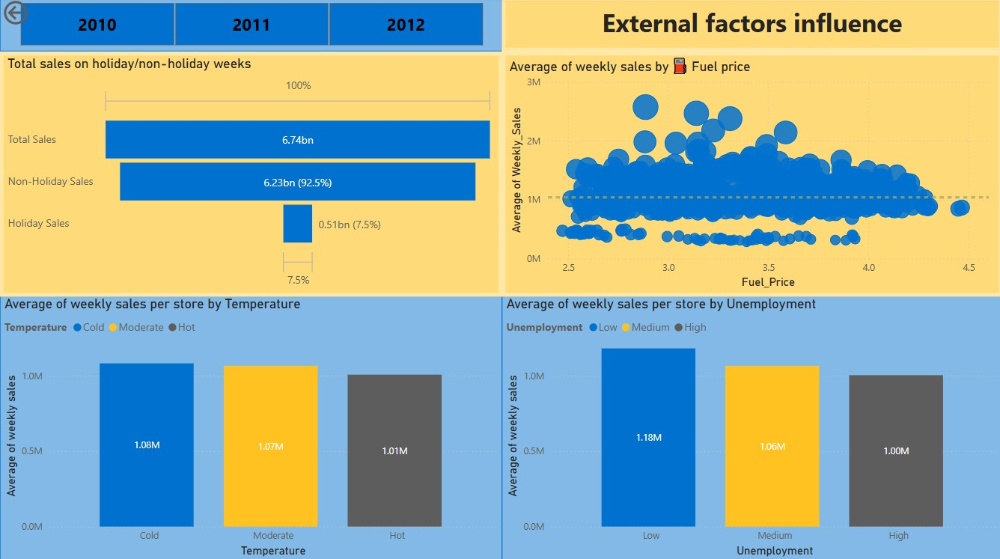

# 📊 Walmart Weekly Sales Analysis (Power BI + SQL)

This project analyzes Walmart's weekly sales data (2010–2012) using SQL and Power BI. It uncovers business insights based on store performance, holiday trends, and external economic factors such as temperature, unemployment, and fuel prices.

---

## 📁 Dataset
- **Source**: Provided CSV of historical weekly sales
- **Duration**: February 2010 – October 2012
- **Features**: Store ID, weekly sales, holiday flags, temperature, fuel price, CPI, unemployment

---

## 🛠 Tools Used
- **SQL (MySQL)** – Data querying and transformation
- **Python (pandas + SQLAlchemy)** – Query automation and export to Excel
- **Power BI** – Dashboard design and data storytelling

---

## 🔍 Key Insights

### 📌 Overview
- 💰 **Total Sales**: \$6.74 billion
- 🏬 **Stores Analyzed**: 45
- 📆 **Avg Weekly Sales (All Stores)**: \$47.11 million
- 🏪 **Avg Weekly Sales per Store**: \$1.05 million

---
## 🏬 Top Performing Stores
- Store 20 had the highest total sales: $301M
- Other high performers:
- Store 4: $299M
- Store 14: $289M
- These stores consistently averaged over $2M/week in sales.

---

### 📅 Weekly Sales Trends
- Sales spike predictably in **November–December**, especially around **Black Friday and Christmas**
- **Top 6 highest sales weeks** include:
  - 24 December 2010 – \$80.9M
  - 23 December 2011 – \$76.9M

---

### 🧨 Holiday Impact
- Holiday weeks generated **7.5% of total sales**:
  - **Holiday weeks**: \$0.51B
  - **Non-holiday weeks**: \$6.23B
- **Per-store avg weekly sales**:
  - Holiday: \$1.12M  
  - Non-holiday: \$1.04M

---

### 🌡️ External Factors Influence

#### 🔥 Temperature
- **Moderate temps (40–70°F)** see slightly higher sales  
  - Moderate: \$1.07M/store  
  - Cold: \$1.08M  
  - Hot: \$1.01M  

#### 📉 Unemployment
- Highest avg sales at **low unemployment levels**  
  - Low: \$1.18M  
  - High: \$1.00M

#### ⛽ Fuel Price
- Slight sales dip as **fuel price increases**
- Avg sales cluster around fuel price of \$2.5–\$3.5

---

## 📊 Dashboard Highlights

---

## 🚀 Next Steps (Optional Enhancements)
- Forecasting weekly sales using Power BI analytics or Prophet in Python
- Predictive modeling based on external variables
